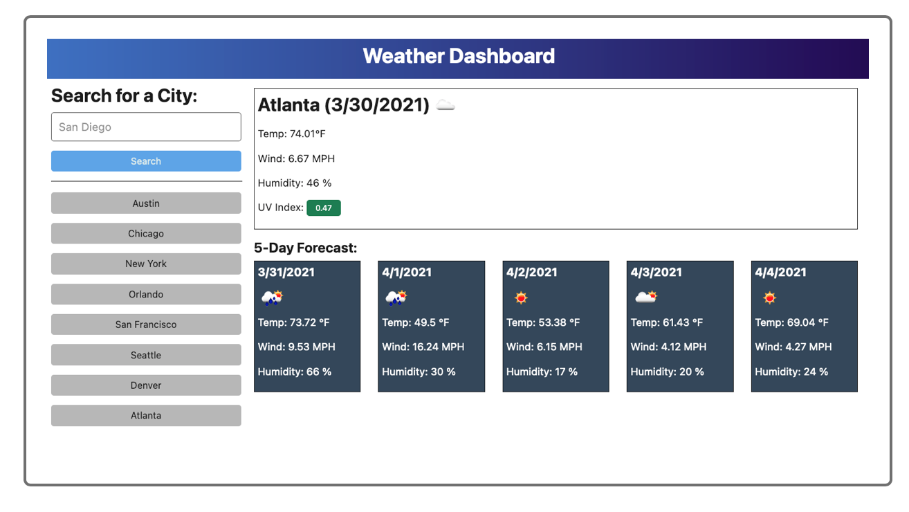

# Weather-Dashboard
The Weather-Dashboard allow a user to enter a city name and report thecurrent weather condition(Temperature, Humidity, Windspeed and UV index) and a 5-Day forecast.  The 5-Day forecast will include a weather icon, temperature, humidity and windspeed. 

Established with:
HTML
Javascript
CSS
Open Weather API
Bootstrap API
Moment

Resources:
-Bootstrap
"https://stackpath.bootstrapcdn.com/bootstrap/4.3.1/css/bootstrap.min.css" 

-Moment js
"https://cdnjs.cloudflare.com/ajax/libs/moment.js/2.24.0/moment.min.js"

-Open Weather API
"https://api.openweathermap.org"

# WeatherDashboard
